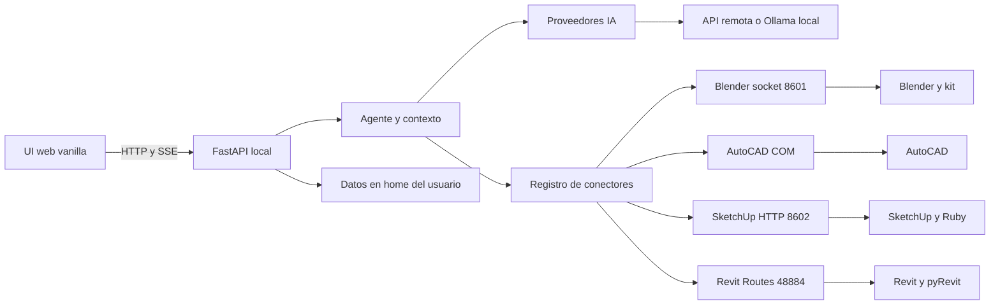

# 01 · Arquitectura

## Vista general

BuildAI es un proceso local de Windows con una frontera HTTP para la interfaz y fronteras de adaptación para modelos y programas de arquitectura. [`main.py`](../buildai/main.py) crea FastAPI, arranca uvicorn y abre pywebview; [`agent.py`](../buildai/agent.py) conserva el bucle de tool calling; los proveedores convierten el historial neutro a cada API; los conectores convierten herramientas en socket, HTTP o COM.

El modelo no accede directamente a los programas: recibe esquemas de herramientas de conectores disponibles, solicita llamadas y el agente las ejecuta. Los puentes solo escuchan en loopback según [`buildai_blender.py`](../buildai/addons/blender/buildai_blender.py), [`buildai_sketchup.rb`](../buildai/addons/sketchup/buildai_sketchup.rb) y [`startup.py`](../buildai/addons/revit/BuildAI.extension/startup.py); AutoCAD se obtiene mediante COM en [`autocad.py`](../buildai/connectors/autocad.py).

## Capas y responsabilidades

| Capa | Responsabilidad | Código |
|---|---|---|
| Presentación | Chat, SSE, adjuntos reducidos, historial, ajustes y tareas rápidas. | [`ui/index.html`](../buildai/ui/index.html), [`ui/app.js`](../buildai/ui/app.js), [`ui/style.css`](../buildai/ui/style.css) |
| Transporte local | Endpoints, archivos estáticos, validación, lock y cola SSE. | [`main.py`](../buildai/main.py) |
| Orquestación | Prompt arquitectónico, conectores, contexto, cancelación y pasos. | [`agent.py`](../buildai/agent.py) |
| Frontera IA | Contratos neutros y traducción a Anthropic o Chat Completions. | [`providers/base.py`](../buildai/providers/base.py), [`providers/`](../buildai/providers/__init__.py) |
| CAD/BIM | Detección, esquemas y ejecución de herramientas. | [`connectors/`](../buildai/connectors/__init__.py) |
| Puentes | Código dentro del hilo principal de Blender, SketchUp o Revit; COM para AutoCAD. | [`addons/`](../buildai/addons/blender/buildai_blender.py) |
| Persistencia | Configuración, sesiones, rutas, catálogo y memoria. | [`config.py`](../buildai/config.py), [`sesiones.py`](../buildai/sesiones.py), [`rutas.py`](../buildai/rutas.py), [`memoria.py`](../buildai/memoria.py) |

## Reglas de dependencia

* `main` importa configuración, instalador, catálogo, sesiones, agente, conectores y skills; no traduce APIs de IA.
* `agent` depende de `config`, `memoria`, `connectors` y `providers`; no conoce detalles HTTP de cada proveedor.
* `providers` recibe historial neutro y depende de su SDK o HTTP.
* `connectors` depende de [`base.py`](../buildai/connectors/base.py); cada conector conoce su canal.
* Los kits no son módulos de la aplicación: Blender y Revit se leen como texto y se anteponen al código enviado al puente.
* La UI solo llama a la API local. Los archivos de usuario quedan fuera del paquete.

## Decisiones implementadas

### Local primero

Servidor y puentes escuchan en `127.0.0.1`. Las claves se guardan en `~/.buildai/config.json`; Ollama es local. Con un proveedor remoto sí se envían a ese proveedor el mensaje, historial y resultados necesarios para producir la respuesta. La motivación de separar datos y código está en [`rutas.py`](../buildai/rutas.py).

### Historial neutro

El agente conserva entradas `usuario`, `asistente` y `resultado`, con [`LlamadaHerramienta`](../buildai/providers/base.py) y adjuntos opcionales. Anthropic conserva `_raw`; el adaptador OpenAI compatible produce `tool_calls` y mensajes `tool`. Así las sesiones y el contexto no dependen de una API concreta.

### Un usuario y una conversación activa

`main.py` mantiene `_historial`, `_sesion_id`, `_ocupado` y `_cancelar` a nivel de módulo. El lock impide dos turnos simultáneos y evita cambiar o borrar la conversación mientras trabaja. Es una decisión para una aplicación local de un usuario.

### Contexto y seguridad operacional

El agente limita a `MAX_PASOS = 100`, `MAX_HISTORIAL = 120`, 8000 caracteres por resultado nuevo y 600 por resultado antiguo. Recorta al inicio de turnos de usuario, comprime resultados y conserva marcas de render. La cancelación se comprueba entre pasos, nunca dentro de una herramienta.

### Hilo, cola y SSE

`/api/chat` transmite mientras `ejecutar_turno` puede bloquear esperando una API o CAD. El trabajo corre en un hilo daemon, publica en `queue.Queue` y la corrutina SSE consume con pausas de 100 ms. La UI recibe progreso sin bloquear el event loop.

## Límites

* No hay autenticación: la protección consiste en escuchar en loopback; otro proceso local podría llamar a la API.
* El agente ejecuta código del modelo dentro de programas CAD/BIM; el README recomienda copias y revisar cambios.
* `main.py` tiene estado global y una conversación activa.
* No existe una transacción común entre conectores: Revit abre una transacción en su puente, Blender y SketchUp ejecutan en el modelo propio.
* La duplicación raíz `addons/` y `skills/` es una deuda técnica de mantenimiento.