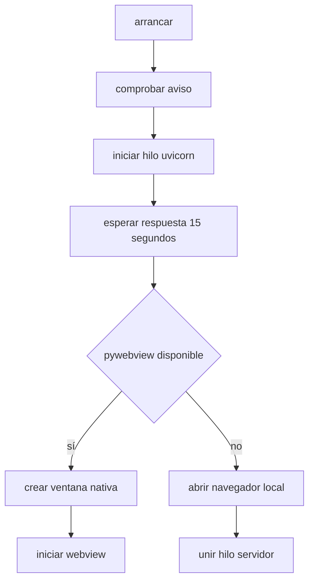
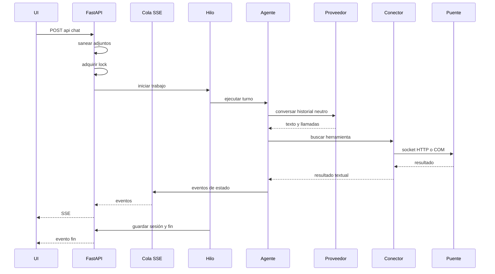
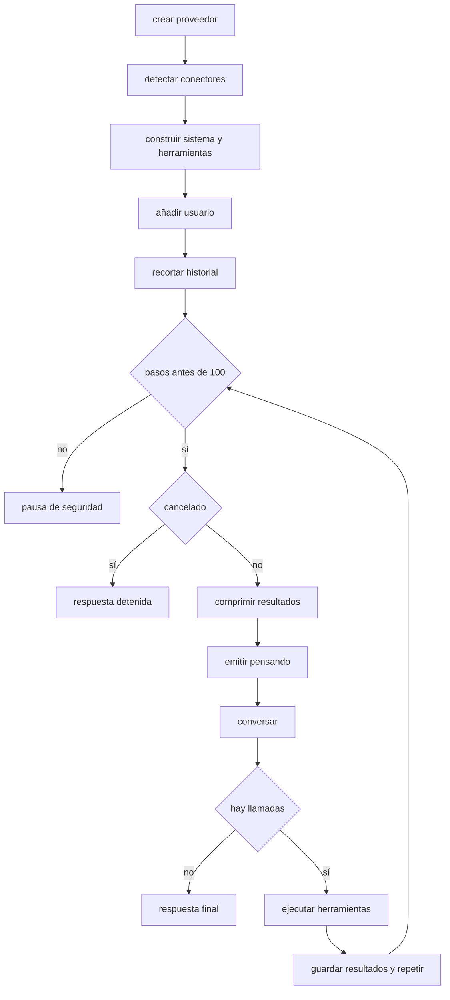
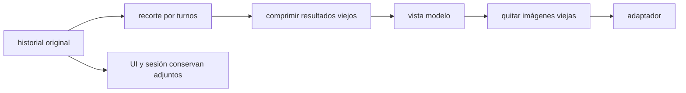
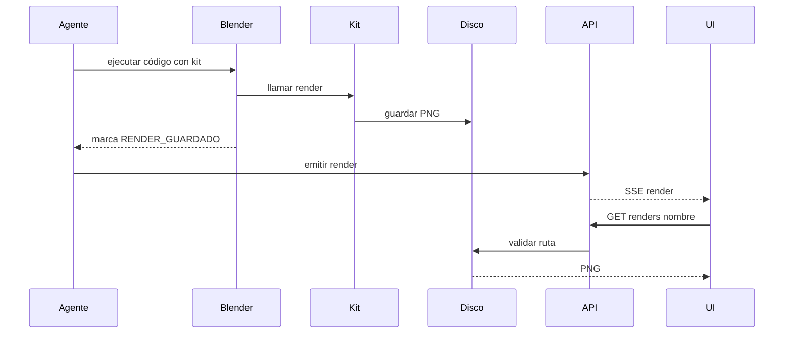
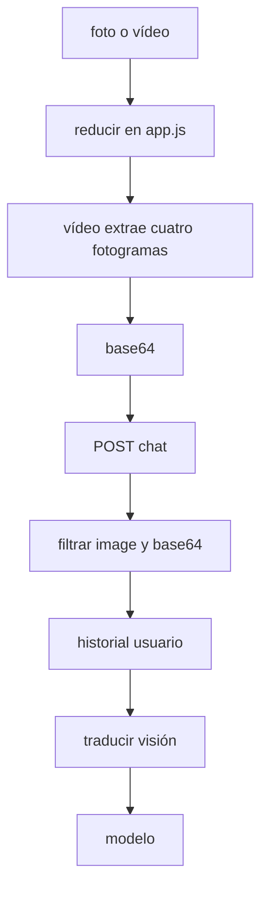
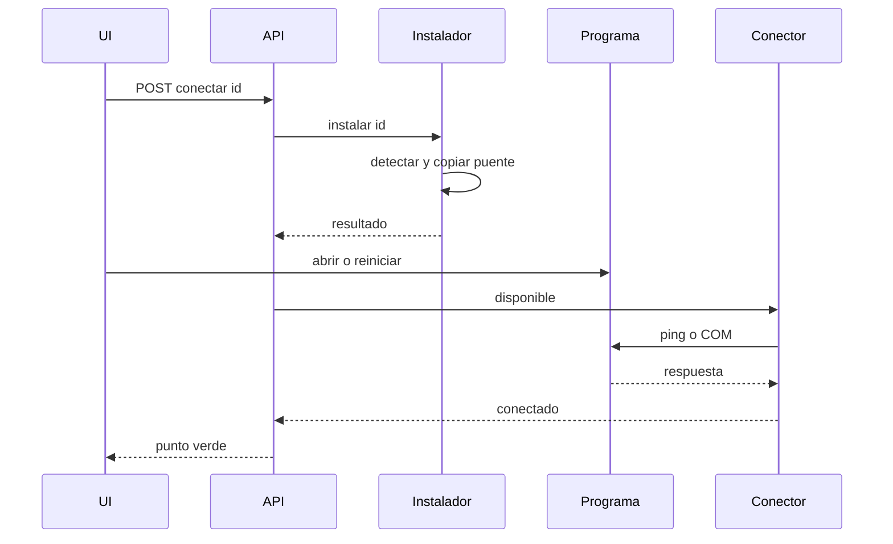
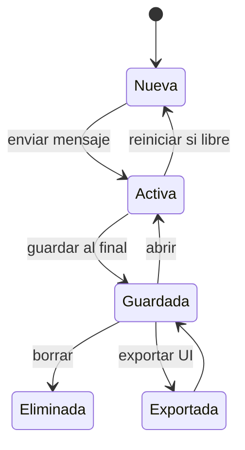

# 03 · Flujos de trabajo

## Arranque

[`arrancar()`](../buildai/main.py) muestra el aviso de instalación peligrosa, inicia uvicorn como daemon y espera con `_esperar_servidor`. Con pywebview crea una ventana 1280×820, mínima 960×640; sin él abre el navegador en 8600.

## Turno de chat

[`chat()`](../buildai/main.py) rechaza una petición sin texto ni adjuntos o un segundo trabajo. El hilo ejecuta [`ejecutar_turno()`](../buildai/agent.py), guarda en `finally`, publica fin y libera el lock.

## Bucle del agente

Se permiten 100 iteraciones. La cancelación se consulta entre pasos; una herramienta ya iniciada termina para no dejar una llamada sin resultado. Herramientas desconocidas generan texto `ERROR`. Las marcas de render producen eventos después de validarse.

## Contexto

`_recortar_historial` elimina entradas antiguas hasta un mensaje `usuario`, evitando romper parejas tool-call y resultado. `_comprimir_resultados` deja los últimos 24 elementos intactos, recorta antiguos a 600 caracteres y conserva `RENDER_GUARDADO:`. `_historial_para_modelo` omite adjuntos de turnos cerrados, pero no muta la lista original.

## Render

[`renders_en_resultado`](../buildai/agent.py) acepta solo archivos reales dentro de `~/.buildai/renders`; [`ver_render`](../buildai/main.py) rechaza separadores, nombres ocultos, extensiones no PNG o archivos inexistentes.

## Adjuntos

La UI usa canvas y selecciona cuatro tiempos de vídeo. El servidor admite como máximo 12 imágenes válidas y 8 MiB por cadena base64. Los proveedores convierten el formato a bloques Anthropic o `data:` URLs compatibles.

## Puentes

[`conectar`](../buildai/main.py) instala y llama a `disponible()` una vez. Puertos y protocolos están en [06](06-conectores.md).

## Sesiones

`reiniciar`, `abrir`, `borrar` y `listar` están en [`main.py`](../buildai/main.py) y [`sesiones.py`](../buildai/sesiones.py). Exportar es una operación de `app.js` que descarga Markdown y no un endpoint.