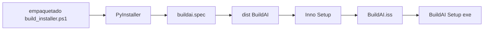

# 10 · Empaquetado y distribución

## Vías de instalación

* El instalador gráfico final es `BuildAI-Setup.exe`.
* [`INSTALAR.bat`](../INSTALAR.bat) prepara o instala desde el repositorio.
* `pip install .`, `pipx install .` y `uv tool install .` usan los metadatos
  de [`pyproject.toml`](../pyproject.toml).
* [`INICIAR.bat`](../INICIAR.bat) y el entry point `buildai` arrancan la app.
* `buildai-instalar` ejecuta `instalar_todos`.

## Instalador de puentes

[`instalador.py`](../buildai/instalador.py) detecta instalaciones conocidas de
Blender, SketchUp y Revit, crea carpetas cuando corresponde y copia los
puentes bajo las rutas de addons o extensiones. AutoCAD no requiere copia:
se automatiza por COM. El instalador puede crear un acceso directo de Windows
y ofrece un aviso porque el agente ejecuta código dentro de aplicaciones CAD.
La detección es best-effort y no arranca ni reinicia los programas.

## Cadena de construcción

[`empaquetado/build_installer.ps1`](../empaquetado/build_installer.ps1) limpia o prepara el proceso,
invoca PyInstaller y después `ISCC.exe`. [`empaquetado/buildai.spec`](../empaquetado/buildai.spec)
usa [`run_buildai.py`](../empaquetado/run_buildai.py) como entry point, salida
`onedir` y ejecutable sin consola. Incluye los recursos que no son módulos
Python:

* `buildai/ui`;
* `buildai/skills_data`;
* `buildai/addons`;
* `blender_kit.py` y `revit_kit.py`.

Los `hiddenimports` incluyen módulos de uvicorn necesarios en el ejecutable.
Las rutas de ejecución siguen usando `Path(__file__).parent`, por lo que las
copias empaquetadas dentro de `buildai/` son las relevantes.

## Inno Setup

[`BuildAI.iss`](../empaquetado/BuildAI.iss) declara `AppVersion 0.3.0`, instala
en `%LOCALAPPDATA%\Programs\BuildAI`, requiere privilegios `lowest`, añade
menú Inicio y desinstalador, y ofrece acceso directo de escritorio. El
resultado se llama `BuildAI-Setup.exe`. La versión del proyecto está también
en `pyproject.toml`; no existe un mecanismo automático de versionado descrito
en el código.

## Web de descarga

[`website/index.html`](../website/index.html) es una landing estática con el
enlace de descarga. No forma parte del servidor FastAPI ni se compila con un
bundler. Al publicar una versión hay que revisar manualmente que el enlace y
la versión visible coincidan con el instalador.

## Limitaciones

PyInstaller e Inno Setup se invocan durante la construcción pero no están
fijados como dependencias Python. El empaquetado es Windows-first y requiere
herramientas instaladas en la máquina de build. El historial de versiones
visible en commits puede complementar `0.3.0`, pero no es un fichero de
metadatos formal y no se asume aquí una política semántica.
