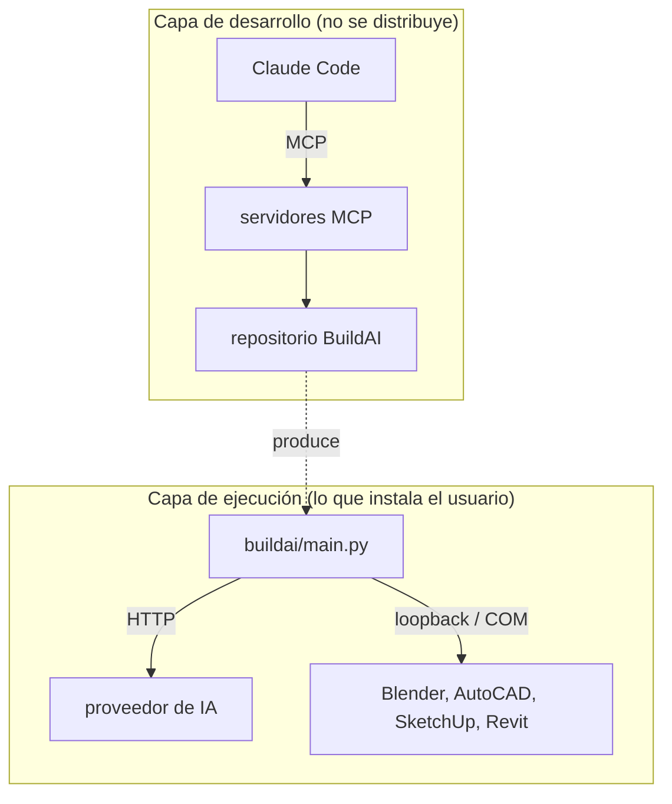

# 13 · MCP y entorno de desarrollo asistido

## Qué es MCP aquí y qué no es

**BuildAI no implementa ni consume MCP en tiempo de ejecución.** No hay
servidor MCP en el paquete, ni cliente MCP, ni dependencia del SDK: la
aplicación habla con los proveedores de IA por su API HTTP
([07 · Proveedores](07-proveedores-ia.md)) y con los programas CAD/BIM por
puentes propios en loopback y COM ([06 · Conectores](06-conectores.md)).

Los servidores MCP de este documento pertenecen a la **capa de desarrollo**:
son las herramientas que usa el asistente (Claude Code) para mantener el
repositorio. Afectan a cómo se escribe y se verifica BuildAI, nunca a lo que
se ejecuta en el equipo del arquitecto que instala la aplicación.



## Servidores configurados

La configuración vive en `~/.claude.json` (ámbito global del usuario). **El
repositorio no incluye `.mcp.json`**: no hay servidores MCP de proyecto, así
que quien clone BuildAI no hereda ninguno y puede trabajar sin ellos.

| Servidor | Transporte | Origen | Para qué se usa en BuildAI |
|---|---|---|---|
| `sequential-thinking` | stdio · `@modelcontextprotocol/server-sequential-thinking` | npx | Razonamiento paso a paso en cambios que cruzan agente, conectores y UI. |
| `memory` | stdio · `@modelcontextprotocol/server-memory` | npx | Grafo de conocimiento persistente entre sesiones sobre decisiones del proyecto. |
| `chrome-devtools` | stdio · `chrome-devtools-mcp` (`--isolated`, viewport 1280x800) | npx | Verificación real de la interfaz servida en `127.0.0.1:8600`: navegar, pulsar, leer consola y red. |
| `accesslint` | stdio · `@accesslint/mcp` | npx | Auditoría de accesibilidad de `buildai/ui` (contraste, semántica, teclado). |
| `obsidian-vault` | stdio · `server-filesystem` acotado a `C:\ANDROMEDA` | npx | Notas de proyecto fuera del repo; el acceso está limitado a esa carpeta. |
| `github` | HTTP · `api.githubcopilot.com/mcp/` | remoto | Issues, PRs y releases del repositorio sin salir de la sesión. |
| `neon` | HTTP · `mcp.neon.tech/mcp` | remoto | Postgres gestionado. BuildAI no usa base de datos: disponible por el entorno, no por el proyecto. |
| `huggingface` | HTTP · `huggingface.co/mcp` | remoto | Consulta del Hub (modelos, datasets). Uso puntual e informativo. |

Además de estos, la sesión puede exponer herramientas MCP procedentes de
plugins instalados en el cliente. Se aplica el mismo criterio: son del
entorno, no del proyecto.

## Cómo encajan en el flujo de trabajo

| Fase del trabajo | Servidor que aporta algo | Qué aporta |
|---|---|---|
| Entender un cambio grande | `sequential-thinking`, `memory` | Descomponer el problema y recuperar decisiones anteriores. |
| Tocar la interfaz (`buildai/ui`) | `chrome-devtools` | Arrancar la app, ejercitar el chat y leer errores de consola en vez de suponer que funciona. |
| Cerrar una UI | `accesslint` | Comprobar contraste y semántica antes de dar por buena la pantalla. |
| Publicar | `github` | Crear la rama, el PR o la release con el instalador adjunto. |

La regla de verificación del proyecto no cambia por usar MCP: un cambio de
interfaz se da por terminado cuando se ha **ejercitado el flujo real**
([12 · Pruebas y desarrollo](12-pruebas-y-desarrollo.md)), y `chrome-devtools`
es el medio para hacerlo sobre el servidor local en lugar de declararlo
"no verificado".

## MCP frente a los conectores de BuildAI

Ambos son "el modelo llamando a herramientas", pero no son la misma capa y
conviene no mezclarlos al leer el código:

| | Conectores de BuildAI | Servidores MCP |
|---|---|---|
| Quién los declara | `buildai/connectors/` | Cliente de desarrollo (`~/.claude.json`) |
| Quién los invoca | El agente de `buildai/agent.py` | El asistente que edita el repositorio |
| Protocolo | HTTP JSON en loopback (8601/8602/48884) y COM | MCP sobre stdio o HTTP |
| Se distribuye al usuario | Sí, dentro del ejecutable | No |
| Formato de herramientas | Esquemas propios traducidos por cada proveedor | Esquemas MCP |

Si alguna vez se quisiera exponer BuildAI **como** servidor MCP (que otro
cliente pilotase Blender o Revit a través de él), sería una fachada nueva
sobre los conectores existentes, equivalente a la API HTTP de
[04 · API HTTP](04-api-http.md). Hoy no existe.

## Seguridad y credenciales

* Las credenciales de los servidores remotos (`github`, `neon`, `huggingface`)
  viven en `~/.claude.json`, **fuera del repositorio**. No deben copiarse a
  `docs/`, a `.claude/settings.local.json` ni a ningún archivo versionado.
* `obsidian-vault` es un servidor de sistema de archivos acotado por argumento
  a `C:\ANDROMEDA`. Ampliar esa ruta amplía lo que el asistente puede leer y
  escribir: es una decisión de seguridad, no de comodidad.
* `chrome-devtools` corre con `--isolated`, en un perfil de Chrome desechable,
  para no operar sobre las sesiones reales del navegador del usuario.
* Un MCP no relaja las
  [notas de seguridad del README](../README.md#-notas-de-seguridad): el agente
  de BuildAI sigue ejecutando código dentro de programas CAD/BIM y se trabaja
  sobre copias.

## Añadir o quitar un servidor

Los servidores se gestionan con el cliente, no editando el JSON a mano:

```powershell
claude mcp list
claude mcp add <nombre> -- npx -y <paquete>
claude mcp remove <nombre>
```

Si en el futuro un servidor pasara a ser necesario **para trabajar en
BuildAI** (y no solo útil para quien lo tenga), el sitio correcto es un
`.mcp.json` versionado en la raíz, con ámbito de proyecto, y una línea en
[12 · Pruebas y desarrollo](12-pruebas-y-desarrollo.md). Mientras la lista sea
personal, se queda en el ámbito global del usuario.
